# Evoluir o readme... 🚧


# Comparação de performance

## Parâmetros e Significados

* wrk:
  * Comando que invoca a ferramenta de benchmark HTTP.
* -t8:
  * Define o número de threads usadas pelo wrk.
  * Cada thread simula um grupo de conexões concorrentes. No exemplo, 8 threads serão criadas.
* -c500:
  * Define o número de conexões simultâneas.
  * Aqui, 500 conexões são abertas para a URL especificada.
* -d5s:
  * Define a duração do teste.
  * 5s significa que o teste será executado por 5 segundos. Você também pode usar m para minutos ou h para horas, caso deseje realizar testes mais longos.
* http://localhost/hello-world:
  * Especifica a URL alvo do benchmark.
  * Essa é a rota que será testada. Certifique-se de que o servidor esteja rodando e a rota esteja acessível antes de executar o comando.

### Symfony hello-world benchmark
```bash
wrk -t8 -c500 -d5s http://localhost/hello-world

Running 5s test @ http://localhost/hello-world
  8 threads and 500 connections
  Thread Stats   Avg      Stdev     Max   +/- Stdev
    Latency     1.22s   536.99ms   1.97s    60.87%
    Req/Sec     6.69      4.82    20.00     69.09%
  79 requests in 5.06s, 21.52KB read
  Socket errors: connect 0, read 0, write 0, timeout 56

Requests/sec:     15.62
Transfer/sec:      4.25KB
```

### HyperF hello-world benchmark
```bash
 wrk -t8 -c500 -d5s http://localhost:9501/hello-world
Running 5s test @ http://localhost:9501/hello-world
  8 threads and 500 connections
  Thread Stats   Avg      Stdev     Max   +/- Stdev
    Latency     5.99ms   14.38ms 269.60ms   96.85%
    Req/Sec    16.82k     2.98k   48.35k    95.98%
  666567 requests in 5.04s, 110.61MB read

Requests/sec: 132316.03
Transfer/sec:     21.96MB
```

---

### Porque Hyperf é mais rápido que Symfony?

Lifecycle do Symfony:
https://symfony.com/doc/current/components/http_kernel.html#the-request-response-lifecycle

Lifecycle do Hyperf:
https://hyperf.wiki/3.1/#/en/lifecycle
https://wiki.swoole.com/en/#/server/methods?id=addprocess


## Diagramas

```mermaid
sequenceDiagram
    autonumber

    participant Client
    participant Kong
    participant Nginx
    participant PHP-FPM
    participant Symfony
    participant Swoole
    participant Hyperf

    Note over Client: Cliente inicia uma requisição REST

    rect rgba(0, 255, 0, 0.1)
    Note over Client, Symfony: Microserviço Symfony
    Client->>Kong: HTTP Request
    Kong->>Nginx: Redireciona para Symfony
    Nginx->>PHP-FPM: Passa requisição via FastCGI
    PHP-FPM->>Symfony: Inicializa Kernel
    Symfony->>Symfony: Processa Rotas, Middleware e Controlador
    Symfony->>PHP-FPM: Retorna Resposta
    PHP-FPM->>Nginx: Resposta HTTP
    Nginx->>Kong: Retorna Resposta
    Kong->>Client: HTTP Response
    end

    rect rgba(255, 0, 0, 0.1)
    Note over Client, Hyperf: Microserviço Hyperf
    Client->>Kong: HTTP Request
    Kong->>Swoole: Redireciona para Hyperf
    Swoole->>Hyperf: Reutiliza Kernel
    Hyperf->>Hyperf: Processa Rotas, Middleware e Controlador
    Hyperf->>Swoole: Retorna Resposta
    Swoole->>Kong: Resposta HTTP
    Kong->>Client: HTTP Response
    end
```

